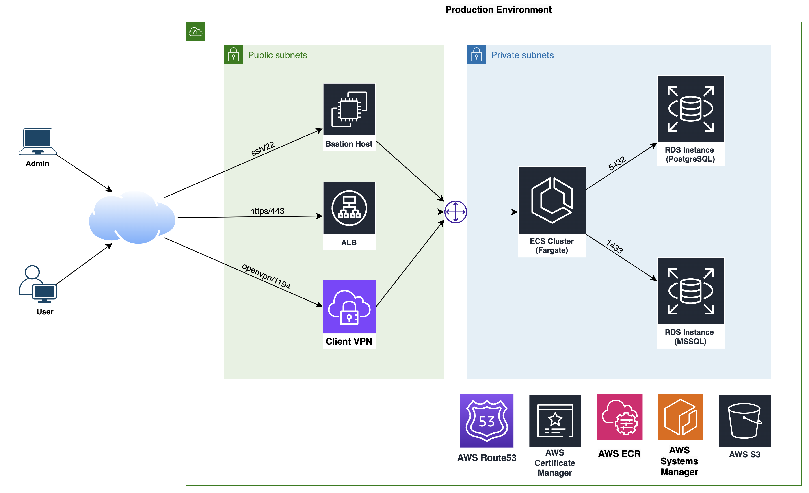

# AWS Cloud



## Infrastructure automation

This repo contains automation tools to manage infrastructure in AWS:
- [terraform](./terraform) - contains terraform plan to create cloud resources (VPC, ALB, EC2 Instances, ECS, ECR, Route53, RDS)

## Services available:

- `Bastion`

    All the resources can be connected privately through AWS EC2 bastion instance. Connect SSH:
    ```bash
    ssh -i terraform/id_rsa ubuntu@<BASTION_PUBLIC_IP_OR_DNS>
    ```

- `Application / API`

  The application endpoint

  DNS is configured with `app_dns_name` variable in terraform configuration [prod.tfvars](./terraform/prod.tfvars)

- `Postgres DB`

  Take connection endpoint from terraform outputs, e.g:
  ```bash
  postgres = "db.us-east-1.rds.amazonaws.com:5432"
  ```

  Credentials are configured `db_instances` variable in terraform configuration [prod.tfvars](./terraform/prod.tfvars)

- `MSSQL DB`

  Take connection endpoint from terraform outputs, e.g:
  ```bash
  mssql = "db.us-east-1.rds.amazonaws.com:1433"
  ```

  Credentials are configured `db_instances` variable in terraform configuration [prod.tfvars](./terraform/prod.tfvars)

- `ECR / Container Registry` (optional):

  Login to the registry:
  ```bash
  aws ecr get-login-password --region us-east-1 | docker login --username AWS --password-stdin account-id.dkr.ecr.us-east-1.amazonaws.com
  ```

  __NOTE:__ that you need to have appropriate IAM permissions to pull and push images
